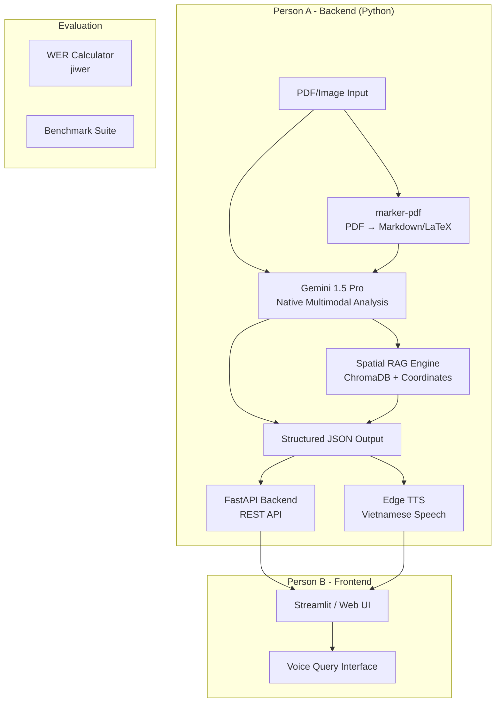

# VisionarySTEM – Implementation Plan

## Mục tiêu dự án

Xây dựng **VisionarySTEM** – một AI Agent đa phương thức (Multimodal) giúp sinh viên khiếm thị tiếp cận tài liệu STEM (PDF, hình ảnh). Hệ thống sử dụng **Gemini 1.5 Pro** để phân tích bố cục, biểu đồ, trích xuất LaTeX, và trả về JSON chuẩn cho Frontend (Người B).

> [!IMPORTANT]
> Dự án này tuân theo nguyên tắc:
> - **KHÔNG** sử dụng API đắt đỏ (Mathpix, Google Document AI)
> - Tận dụng tối đa khả năng native multimodal của Gemini
> - Output là **structured JSON** để Người B tích hợp trực tiếp

---

## Kiến trúc tổng thể



---

## Hợp đồng JSON giữa Person A & Person B

Đây là **API Contract** – cả hai bên phải tuân theo định dạng này:

```json
{
  "document_metadata": {
    "filename": "physics_chapter1.pdf",
    "total_pages": 1,
    "processing_time_ms": 1250,
    "model_used": "gemini-1.5-pro"
  },
  "content_blocks": [
    {
      "id": "block_001",
      "type": "text | math | chart | table | figure",
      "raw_content": "Newton's Second Law of Motion.",
      "latex": null,
      "spoken_text": "Định luật hai của Niu-tơn.",
      "language": "vi",
      "confidence": 0.95,
      "coordinates": {
        "page": 1,
        "x": 10,
        "y": 20,
        "w": 80,
        "h": 5,
        "region": "top-left"
      }
    },
    {
      "id": "block_002",
      "type": "math",
      "raw_content": "F = ma",
      "latex": "F = ma",
      "spoken_text": "Lực bằng khối lượng nhân gia tốc",
      "language": "vi",
      "confidence": 0.98,
      "coordinates": {
        "page": 1,
        "x": 10,
        "y": 30,
        "w": 30,
        "h": 10,
        "region": "top-left"
      }
    },
    {
      "id": "block_003",
      "type": "chart",
      "raw_content": "[Image: Linear graph showing Force vs Acceleration]",
      "latex": null,
      "spoken_text": "Biểu đồ đường thẳng thể hiện mối quan hệ tỉ lệ thuận giữa lực và gia tốc",
      "language": "vi",
      "confidence": 0.90,
      "coordinates": {
        "page": 1,
        "x": 50,
        "y": 50,
        "w": 40,
        "h": 30,
        "region": "center-right"
      }
    }
  ],
  "spatial_index": {
    "regions": {
      "top-left": ["block_001", "block_002"],
      "center-right": ["block_003"]
    }
  }
}
```

> [!TIP]
> **Cho Person B**: Chỉ cần gọi REST API, nhận JSON này và render. Mọi xử lý AI đều nằm ở Backend Person A.

---

## Cấu trúc thư mục dự án

```
d:\VisionarySTEM\
├── .env                          # API keys (KHÔNG push lên GitHub)
├── .env.example                  # Template cho contributors
├── .gitignore                    # Bỏ .env, __pycache__, uploads/
├── README.md                     # Hướng dẫn cài đặt & chạy
├── requirements.txt              # Dependencies
├── pyproject.toml                # Project metadata
│
├── src/
│   ├── __init__.py
│   ├── config.py                 # Load .env, cấu hình chung
│   │
│   ├── core/
│   │   ├── __init__.py
│   │   ├── gemini_engine.py      # [CORE] Gọi Gemini 1.5 Pro API
│   │   ├── document_processor.py # [CORE] Xử lý PDF/Image → content blocks
│   │   ├── spatial_rag.py        # [CORE] Spatial RAG với ChromaDB
│   │   └── math_handler.py       # Xử lý LaTeX → spoken Vietnamese
│   │
│   ├── tts/
│   │   ├── __init__.py
│   │   └── edge_tts_engine.py    # Edge TTS integration
│   │
│   ├── evaluation/
│   │   ├── __init__.py
│   │   └── wer_calculator.py     # WER evaluation script
│   │
│   ├── api/
│   │   ├── __init__.py
│   │   ├── main.py               # FastAPI app entry point
│   │   ├── routes.py             # API endpoints
│   │   └── schemas.py            # Pydantic models (JSON contract)
│   │
│   └── utils/
│       ├── __init__.py
│       └── helpers.py            # Tiện ích chung
│
├── tests/
│   ├── test_gemini_engine.py
│   ├── test_document_processor.py
│   ├── test_spatial_rag.py
│   ├── test_wer.py
│   └── sample_data/
│       ├── sample_physics.pdf    # PDF mẫu để test
│       └── sample_math.png       # Ảnh công thức mẫu
│
├── scripts/
│   ├── run_benchmark.py          # Chạy benchmark WER + latency
│   └── demo.py                   # Demo script nhanh
│
└── docs/
    ├── api_contract.md           # Tài liệu API cho Person B
    └── architecture.md           # Sơ đồ kiến trúc
```

---

## Chi tiết triển khai từng Module

### Phase 1: Foundation (Ưu tiên cao nhất)

---

#### [NEW] `.env.example`
```
GEMINI_API_KEY=your_gemini_api_key_here
GEMINI_MODEL=gemini-1.5-pro
TTS_VOICE=vi-VN-HoaiMyNeural
MAX_FILE_SIZE_MB=20
```

#### [NEW] `src/config.py`
- Load biến môi trường từ `.env` bằng `python-dotenv`
- Validate API key tồn tại
- Export các constant: `GEMINI_MODEL`, `TTS_VOICE`, `MAX_FILE_SIZE_MB`

---

#### [NEW] `src/api/schemas.py` – Pydantic Models (JSON Contract)

Định nghĩa toàn bộ schema cho API contract:

```python
class Coordinates(BaseModel):
    page: int
    x: float   # % from left
    y: float   # % from top
    w: float   # width %
    h: float   # height %
    region: str # "top-left", "top-right", "center", etc.

class ContentBlock(BaseModel):
    id: str
    type: Literal["text", "math", "chart", "table", "figure"]
    raw_content: str
    latex: Optional[str]
    spoken_text: str
    language: str = "vi"
    confidence: float
    coordinates: Coordinates

class SpatialIndex(BaseModel):
    regions: dict[str, list[str]]

class DocumentMetadata(BaseModel):
    filename: str
    total_pages: int
    processing_time_ms: int
    model_used: str

class DocumentAnalysisResponse(BaseModel):
    document_metadata: DocumentMetadata
    content_blocks: list[ContentBlock]
    spatial_index: SpatialIndex
```

> [!IMPORTANT]
> Schema này là **hợp đồng** giữa Person A và Person B. Mọi thay đổi phải được cả hai bên đồng ý.

---

#### [NEW] `src/core/gemini_engine.py` – Gemini 1.5 Pro Engine

**Chức năng chính:**
1. Upload PDF/Image qua Files API
2. Gửi prompt multimodal yêu cầu phân tích bố cục + trích xuất LaTeX + tọa độ không gian
3. Nhận structured JSON response thông qua `response_schema` (Pydantic)
4. Hỗ trợ streaming cho latency thấp

**Prompt chiến lược:**
```
Bạn là một AI chuyên phân tích tài liệu STEM cho người khiếm thị.
Phân tích trang tài liệu này và trả về JSON với:
1. Mỗi khối nội dung (text, math, chart, table, figure) 
2. Tọa độ (x, y, w, h) tính theo phần trăm trang
3. Với công thức toán: trích xuất LaTeX và viết diễn giải tiếng Việt
4. Với biểu đồ: mô tả chi tiết bằng tiếng Việt
5. Gán region: top-left, top-right, center, bottom-left, bottom-right, etc.
```

**Kỹ thuật quan trọng:**
- Sử dụng `response_mime_type='application/json'` + `response_schema`
- Prompt bằng tiếng Việt để output tiếng Việt tự nhiên
- Retry logic với exponential backoff

---

#### [NEW] `src/core/document_processor.py` – Document Processor

**Pipeline xử lý:**
```
PDF Input
    │
    ├─→ [Optional] marker-pdf → Markdown/LaTeX (pre-processing)
    │
    └─→ Gemini 1.5 Pro (multimodal analysis)
            │
            ├─→ Content Blocks extraction
            ├─→ Spatial coordinates
            ├─→ Math LaTeX extraction  
            └─→ Vietnamese spoken text
                    │
                    └─→ Structured JSON Output
```

- Xử lý cả PDF (nhiều trang) và Image (đơn lẻ)
- Merge kết quả từ marker-pdf + Gemini để tăng accuracy
- Đo processing time cho metadata

---

### Phase 2: Spatial RAG & TTS

---

#### [NEW] `src/core/spatial_rag.py` – Spatial RAG Engine

**Mục đích:** Cho phép truy vấn theo vị trí không gian (voice query)

**Cách hoạt động:**
1. Sau khi Gemini phân tích → lưu content blocks + coordinates vào ChromaDB
2. Mỗi block được embed bằng Gemini Embedding API
3. Khi user hỏi "Góc trên bên phải có gì?" → filter theo region → retrieve blocks
4. Khi user hỏi "Công thức dưới biểu đồ?" → sử dụng spatial relationship reasoning

**ChromaDB Collection Schema:**
```python
{
    "id": "block_001",
    "document": "raw_content + spoken_text",
    "metadata": {
        "type": "math",
        "page": 1,
        "x": 10, "y": 30, "w": 30, "h": 10,
        "region": "top-left",
        "latex": "F = ma"
    },
    "embedding": [...] # Gemini embedding
}
```

---

#### [NEW] `src/tts/edge_tts_engine.py` – Text-to-Speech

- Sử dụng `edge-tts` library với giọng `vi-VN-HoaiMyNeural`
- Input: `spoken_text` từ content blocks
- Output: file `.mp3` hoặc audio stream
- Hỗ trợ đọc tuần tự (block by block) hoặc đọc toàn trang

---

### Phase 3: API & Evaluation

---

#### [NEW] `src/api/main.py` + `src/api/routes.py` – FastAPI Backend

**Endpoints cho Person B:**

| Method | Endpoint | Chức năng |
|--------|----------|-----------|
| `POST` | `/api/v1/analyze` | Upload PDF/Image → nhận JSON analysis |
| `POST` | `/api/v1/query` | Spatial voice query (text) |
| `GET` | `/api/v1/tts/{block_id}` | Lấy audio cho một block |
| `GET` | `/api/v1/tts/page/{page}` | Audio cho toàn trang |
| `GET` | `/api/v1/health` | Health check |

---

#### [NEW] `src/evaluation/wer_calculator.py` – WER Evaluation

- Sử dụng `jiwer` library
- So sánh `spoken_text` của AI vs ground truth (người đọc thủ công)
- Tính WER, CER (Character Error Rate)
- Export báo cáo dạng JSON/CSV cho slides

```python
# Example output:
{
    "total_blocks": 15,
    "average_wer": 0.08,    # 8% error rate
    "average_cer": 0.03,
    "math_wer": 0.05,       # Math blocks specifically
    "text_wer": 0.10,
    "processing_latency_avg_ms": 1100
}
```

---

## Dependencies (`requirements.txt`)

```
# Core AI
google-genai>=1.0.0
pydantic>=2.0

# Document Processing
marker-pdf
PyMuPDF

# Spatial RAG
chromadb

# Text-to-Speech
edge-tts

# API Server
fastapi
uvicorn[standard]
python-multipart

# Evaluation
jiwer

# Config
python-dotenv

# Utils
aiofiles
httpx
```

---

## Kế hoạch hợp tác Person A & Person B

### Person A (Backend - Bạn) chịu trách nhiệm:
- Toàn bộ thư mục `src/`
- AI pipeline: Gemini → JSON → TTS
- API endpoints
- Đảm bảo JSON output đúng schema
- WER evaluation & benchmarks

### Person B (Frontend) chịu trách nhiệm:
- Giao diện web (Streamlit hoặc React)
- Gọi API endpoints từ Person A
- Voice recording → text (Speech-to-Text)
- Hiển thị kết quả (highlight vùng trên PDF)
- Audio playback

### Cách hợp tác:
1. **Shared repo trên GitHub** – cả hai cùng commit
2. **Branch strategy**: `main` ← `dev` ← `feature/xxx`
3. **API Contract** (file `docs/api_contract.md`): Thống nhất trước, code sau
4. **Person B có thể bắt đầu ngay** với mock data theo schema ở trên
5. **Giao tiếp**: Qua file `docs/api_contract.md` + GitHub Issues

> [!WARNING]
> Person B **KHÔNG cần chờ** Person A hoàn thành. Dùng mock JSON để phát triển Frontend song song.

---

## Verification Plan

### Automated Tests
```bash
# Unit tests
pytest tests/ -v

# Test Gemini connection
python -m pytest tests/test_gemini_engine.py -v

# Test full pipeline
python scripts/demo.py --input tests/sample_data/sample_physics.pdf

# Run WER benchmark
python scripts/run_benchmark.py
```

### Manual Verification
1. Upload PDF vật lý/toán → kiểm tra JSON output
2. Verify tọa độ bằng cách overlay lên PDF gốc
3. Nghe audio TTS → so sánh với expected
4. Test spatial queries: "Góc trên bên phải?", "Công thức nào ở giữa trang?"

### Metrics mục tiêu (cho báo cáo cuộc thi)
| Metric | Target |
|--------|--------|
| WER (Text blocks) | < 10% |
| WER (Math blocks) | < 5% |
| Latency (1 page) | < 3 giây |
| Latency (streaming first block) | < 1 giây |
| Math LaTeX accuracy | > 95% |

---

## Open Questions

> [!IMPORTANT]
> **Câu hỏi cho bạn trước khi bắt đầu code:**
> 1. Bạn đã có **Gemini API Key** chưa? (Cần key để test)
> 2. Person B sử dụng **Streamlit hay React/Next.js** cho Frontend?
> 3. Bạn muốn bắt đầu với **Phase nào trước**? (Đề xuất: Phase 1 – Foundation)
> 4. Có file PDF mẫu STEM nào cụ thể bạn muốn test không?
> 5. Ngôn ngữ README và docs: **Tiếng Việt hay Tiếng Anh**?
